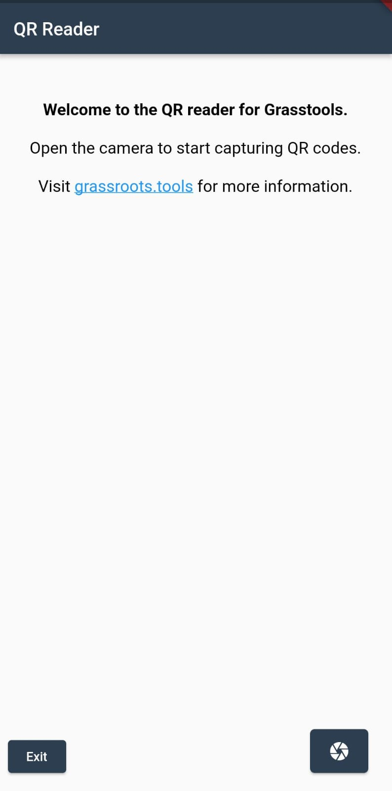
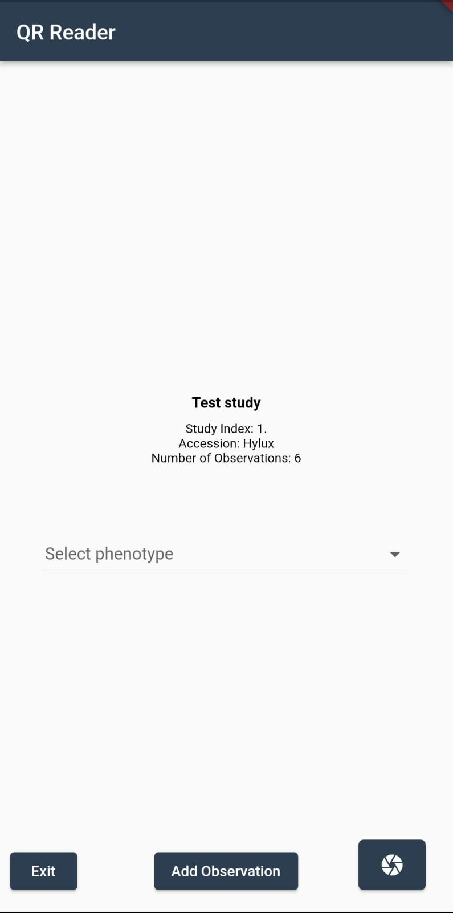
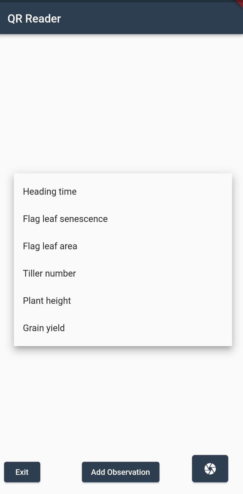
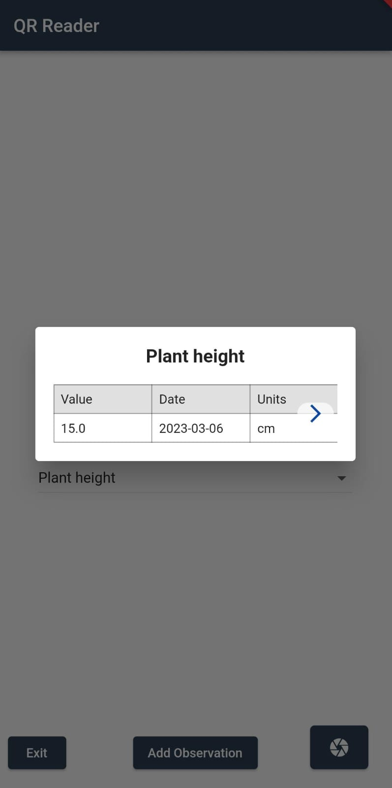
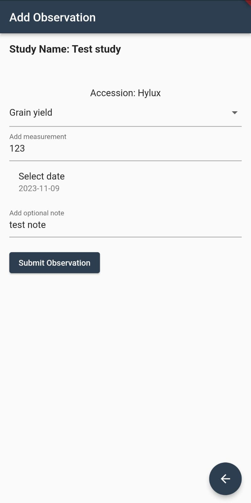

# Mobile App for Grassroots Field Trials

## Description

The mobile app displays and submit the observations in field trials. It is written in Flutter and will available for both Android and iOS. The current version is a prototype and it is only available for Android.

The app scans QR codes which identify individual plots within a field trial study. It then displays the details of the plot on the screen. The user have the option to enter new  observations for the plot and submit them to the Grassroots Field Trial system.

The app is can be downloaded from the [Google Play Store](https://play.google.com/store/apps/details?id=tools.grassroots.qr_reader).
 

## Usage

The unique id for each plot in a study is encoded as a QR code. The app scans the QR code and retrieves the details of a given plot. At the moment there will be only one simple study with QR codes available for testing. 

To start using simply open the camera button and point the camera to the QR code. The app will automatically scan the QR code and retrieve the observations, if any, for the plot.

    
    

To display the observation of a specific phenotype, the user can select the available phenotypes from the dropdown menu. The app will display a table of observations for the selected phenotype.
 
 

    
    

If the plot has no observations, the app will display a message saying that there are no observations for the plot. The user can then enter new observations by clicking on the `Add Observation` button. The app will display a form where the user can enter the details of the observation. The user can then submit the observation by clicking on the `Submit Observation` button.

 

    

 This a sample QR code for the plot 1 in the test study:

The QR codes for the plots in the test study are available in the [QR_codes](QR_codes) directory. The QR codes are named after the plot id. For example, the QR code for plot 1 is in the file [1.png](QR_codes/1.png).
