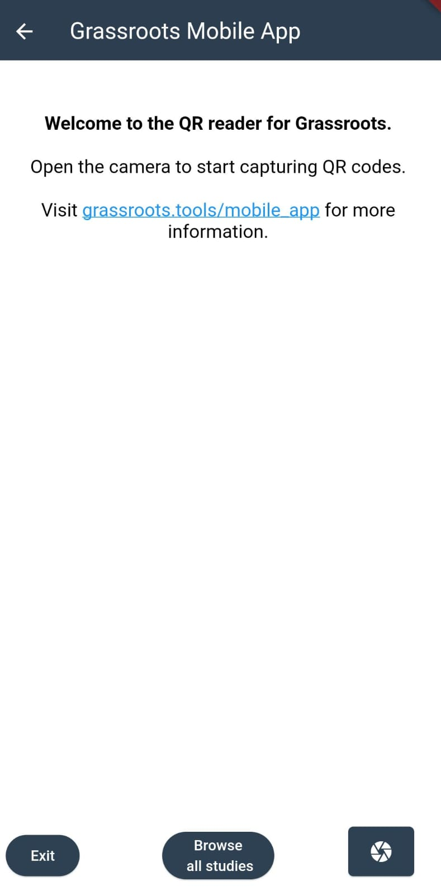
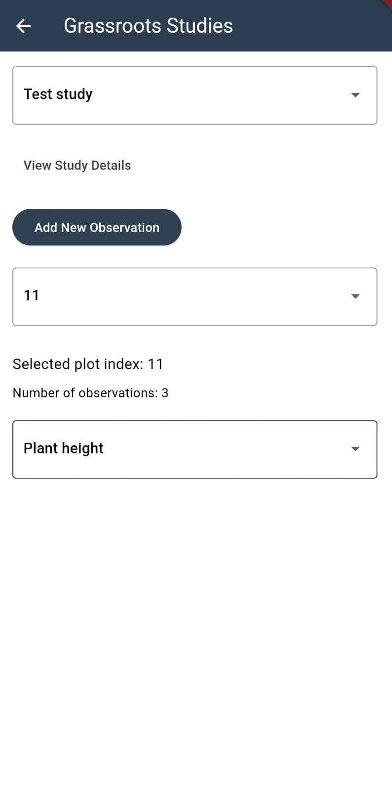
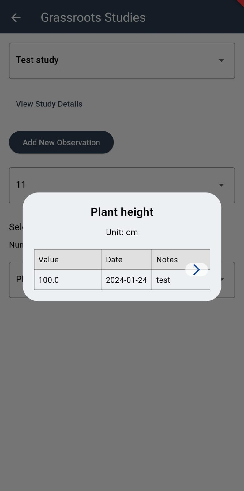
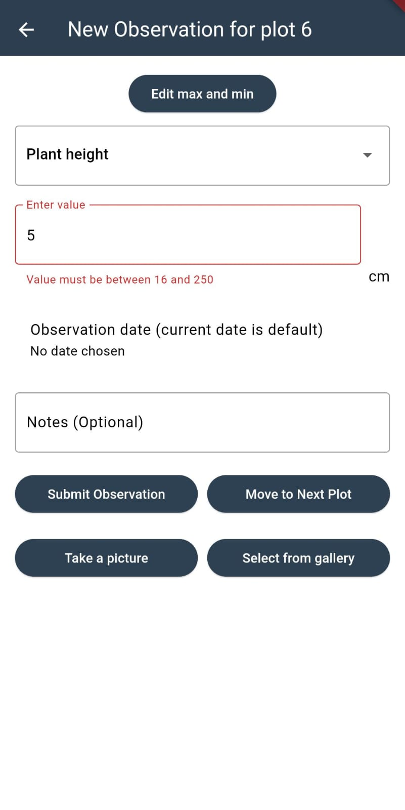

# Mobile App for Grassroots Field Trials

## Introduction

The mobile app displays and submit the observations in field trials. It is written in Flutter and will available for both Android and iOS. The current version is a prototype and it is only available for Android.

The app scans QR codes which identify individual plots within a field trial study. It then displays the details of the plot on the screen. The user have the option to enter new  observations for the plot and submit them to the Grassroots Field Trial system.

The app is can be downloaded from the [Google Play Store](https://play.google.com/store/apps/details?id=tools.grassroots.qr_reader).

At the moment there will be only one simple study with QR codes available for testing. 

## Getting Started

Any study can be selected by browsing from the home screen. The user can select a study by clicking on the study name from a dropdown menu. 

    

Once a study is selected, the app will display a menu for selecting any plot by plot index. If the plot has observations recorded, the number of observations in that plot will be displayed below the plot index. The user then can select a phenotype to see the observations for that phenotype. A table with the observations for the selected phenotype will be displayed.
 

    
    

General details from the study can be displayed by clicking on the `View Study Details` button. 

## Submitting Observations

Once a plot is selected, the user can submit new observations by clicking on the `Add New Observation` button. 

    

