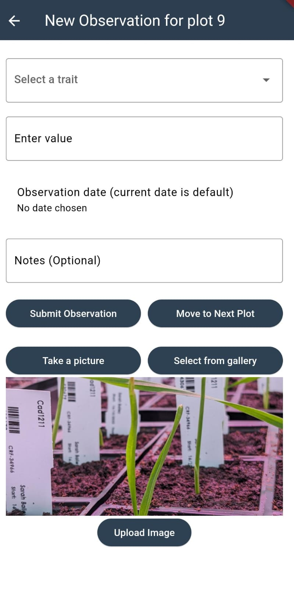
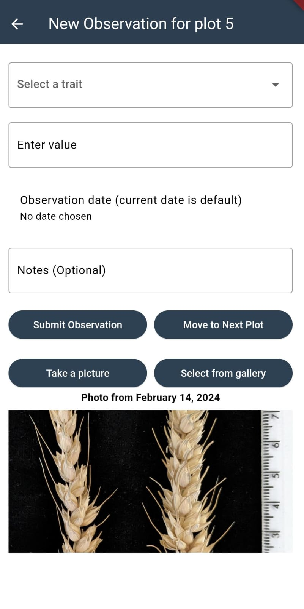

# Mobile App for Grassroots Field Trials

## Introduction

The mobile app displays and submit the observations in field trials. It is written in Flutter and will available for both Android and iOS. The current version is a prototype and it is only available for Android.

The app scans QR codes which identify individual plots within a field trial study. It then displays the details of the plot on the screen. The user have the option to enter new  observations for the plot and submit them to the Grassroots Field Trial system.

The app is can be downloaded from the [Google Play Store](https://play.google.com/store/apps/details?id=tools.grassroots.qr_reader).

At the moment there will be only one simple study with QR codes available for testing. 

## Getting Started

Any study can be selected by browsing from the home screen. The user can select a study by clicking on the study name from a dropdown menu. 

    

Once a study is selected, the app will display a menu for selecting any plot by plot index. If the plot has observations recorded, the total number of observations in that plot will be displayed. The user then can select a phenotype to open a table that shows all the observations for that plot. The table will display the phenotype, date and additional notes.
 

    
    

The general details from the study can be displayed by clicking on the `View Study Details` button. 

## Submitting Observations

Once a plot is selected, the user can submit new observations by clicking on the `Add New Observation` button. The app will display a form where the user can enter the details of a new observation. First, the user selects the phenotype from the dropdown menu. The unit of selected phenotype will be displayed next to the field where the actual observation value will be entered.

The current date is automatically added to the form but it can be changed by the user. Optionally, the user can add additional notes to the observation.

There is only one validation in place at the moment. It is for the plant height ([cropontology.org/term/CO_321:0000020](https://cropontology.org/term/CO_321:0000020)). When the plant height is selected, a button to enter or edit the minimum and maximum values will be displayed. The user can click on the button to change the values. Then if the  user enters an observation value that is outside the range, the observation will not be submitted and an error message will be displayed.

    
    

Once an observation is submitted, the form will be cleared and the user can enter another observation or move to the next plot by clicking on the `Move to Next Plot` button.

## Attaching images to observations

 The user can also take a photo and attach it to the selected plot. The photo can be taken by clicking on the `Take a picture` button or selected from the gallery by clicking on the `Select from Gallery` button. The photo will be displayed in the form and if the user wants to use it, the photo can be submitted by clicking on the `Upload Image` button. If a plot already has a photo attached, the photo will be retrieved from the server and displayed in the form with the date it was taken. A new photo can be taken and it will be added with the new date it was taken. The photos can be seen in full size by clicking on the photo. 

    
    

 

